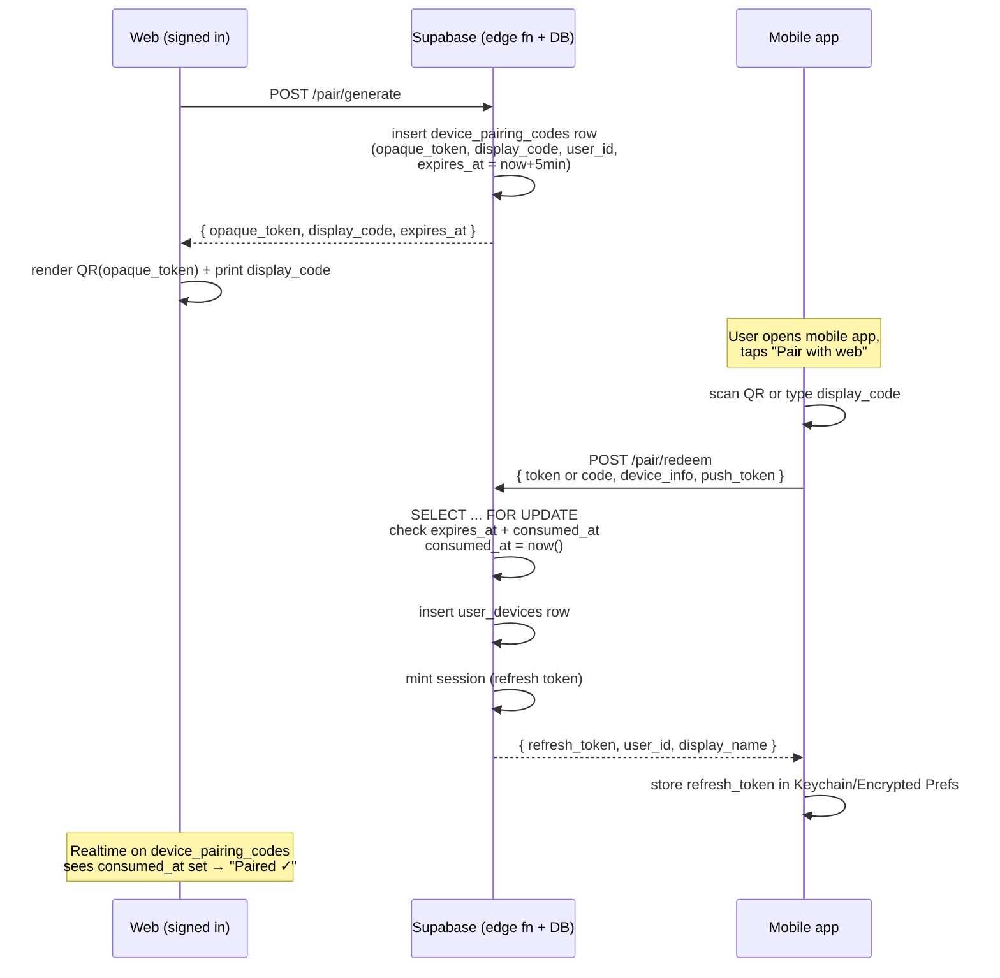

# Account and Pairing

**Status:** v1.0 — 2026-04-19
**Supersedes:** `AUTHENTICATION_FLOW.md`, `AUTHENTICATION_QUICK_REFERENCE.md`, `PHASE1_AUTHENTICATION_SETUP.md` (all Twilio/SMS-era).

---

## 1. Overview

Izzy Yum accounts are **email-verified, passwordless, and identified in the UI by a user-chosen display name**. The canonical identity is an opaque UUID that the user normally never sees. Phone numbers and SMS are gone; Twilio is removed from the stack.

The web app is the **primary** surface (where people plan and cook). Mobile apps (iOS first, Android later) are **companions** that receive shopping lists via Realtime and push notifications. Mobile devices are linked to a web account via a **QR + 6-digit code pairing flow**.

Three sign-in methods are offered; the user picks one at signup and can add others later:

| Method              | Primary on | Requires typed email? |
|---------------------|------------|-----------------------|
| Sign in with Apple  | iOS        | Yes (as recovery anchor; can differ from Apple's) |
| Sign in with Google | Android    | Yes (same) |
| Email magic link    | All        | Yes (used directly) |

**No passwords.** Session persistence handles the "I hate checking email every login" problem — see §4.

---

## 2. Account model

### 2.1 Canonical identity

Every account is keyed by `users.id UUID`. This ID is:

- Stable for the life of the account.
- Never shown in normal UI.
- Visible only in **Settings → Account ID**, for the rare user who needs it (support tickets, debugging).
- The foreign key used by every other table (`shopping_lists.user_id`, `user_devices.user_id`, etc.).

### 2.2 Fields required at signup

1. **Display name** (`users.display_name TEXT NOT NULL`) — freely chosen, **non-unique**, no uniqueness check. Two users can both be "Edwin". Disambiguated by UUID internally; users identify each other (for any future social features) via the reserved `handle` column (§2.4), not the display name.
2. **Email** (`users.email TEXT NOT NULL UNIQUE`) — the recovery anchor. Required for every user, regardless of sign-in method. Must be verified to be considered "owned" (§3.4).

### 2.3 Fields NOT on the account

- ❌ No `phone`, no `phone_verified`.
- ❌ No `password_hash`.
- ❌ No real name, address, or payment info (out of scope entirely).

### 2.4 Display vs. identity

A clear rule: **UI shows display name. Database joins use UUID. Nothing else.** A `users.handle TEXT UNIQUE` column is reserved now (nullable, unused in UI) so that when we ship social features — sharing a shopping list, friend lookup — we can issue short handles like `@cook-3a4f` without a schema migration at that point. Reserving it now costs nothing at signup (no user-facing UX) and avoids a future `ALTER TABLE` on a populated table. Until the social features ship, the UUID is the only cross-reference and it stays internal.

---

## 3. Signup flow

### 3.1 Goal

Shortest possible path from "nothing" to "signed in with a recoverable account."

### 3.2 Screens

Signup is a single screen with three action buttons — one per sign-in method. Name and email can be typed directly (required for the email-magic-link path) or pre-filled from the OAuth provider (optional for Apple/Google paths).

```
┌──────────────────────────────────────┐
│  Create your Izzy Yum account        │
│                                      │
│  What should we call you?            │
│  [ ________________________ ]        │
│  (Leave blank to use your Apple      │
│   or Google name.)                   │
│                                      │
│  Your email                          │
│  [ ________________________ ]        │
│  (Leave blank to use your Apple      │
│   or Google email.)                  │
│                                      │
│    [  Continue with Apple  ]         │
│    [  Continue with Google ]         │
│    [  Continue with email  ]         │
└──────────────────────────────────────┘
```

Button behavior:

- **Continue with Apple / Google** — starts OAuth immediately. On return, any blank fields are pre-filled with the provider's `name` and `email` claims, and we show a **confirm** screen where the user can edit before account creation:

  ```
  ┌──────────────────────────────────┐
  │  Almost done                     │
  │                                  │
  │  Display name                    │
  │  [ Edwin Smith          ]  ✏️    │  (from provider; editable)
  │                                  │
  │  Email                           │
  │  [ edwin@example.com    ]  ✏️    │  (from provider; editable)
  │                                  │
  │             [ Create account → ] │
  └──────────────────────────────────┘
  ```

  The user's *typed* values always win over provider values; we only fall back to the provider for fields left blank. If the provider returns no name (Apple allows users to hide it), the display-name field stays blank and the [Create account] button is disabled until the user fills it.

- **Continue with email** — disabled until both name and email are filled. Clicking sends a magic link to the typed address; when the user clicks the link, signup completes and the email is verified in one step. The typed name is passed as metadata so it persists into the `users` row on creation.

Button order follows platform convention: Apple on top for iOS (App Store guidance), Google on top for Android, platform-detected default on web.

Validation:

- Display name: non-empty string (on the confirm screen, after any pre-fill), trimmed, ≤ 40 chars, no uniqueness check.
- Email: RFC 5322 validation, lowercased for storage.
- Neither field is editable after signup without an explicit Settings action (to prevent accidental identity churn).

### 3.3 Email authority rule

The email typed on the signup (or confirm) screen is **authoritative** for the account. If the user picks Sign in with Apple or Google and edits the pre-filled email to something different from the provider's:

- We store the provider's email only as metadata on the `user_identities` row (Supabase's internal table).
- We do **not** overwrite `users.email` with the provider's version.
- We do **not** prompt the user to choose or reconcile. Keep it simple.

This makes the account model: *one account, one recovery email, many linked sign-in methods.*

### 3.4 Email verification

- On signup completion, Supabase sends a verification email to the confirmed address (link valid 1 hour).
- The account is usable **immediately** with a banner prompting verification.
- Until verified, the email is **not considered owned.** A different person can claim the same address by verifying it first, which would detach it from this account. (This is standard email-verification semantics; see §7 threat notes.)
- Once verified, the email is locked to this account. Changing it requires re-verification of the new address.

### 3.5 Sign-in method flows

**Email magic link**

1. Supabase sends a magic link to the typed email.
2. User clicks the link → signed in + email verified in one step.
3. Done.

**Sign in with Apple / Google**

1. Standard OAuth redirect (Supabase handles the provider dance).
2. On return, we have a verified provider identity, plus the provider's `name` and `email` claims (when available). Any blank fields on the signup screen are pre-filled with provider values on the confirm screen (§3.2); typed values always win.
3. In parallel, we send an email verification link to the confirmed email (see §3.4). User can verify now or later — doesn't block sign-in.
4. Done.

### 3.6 Mobile-first signup (no existing web account)

If a user installs the iOS or Android app first, the app asks:

```
Do you already have an Izzy Yum account on the web?

   [ Yes — scan QR to link this device ]   (§5)

   [ No — create a new account         ]
```

"No" branches into the same signup screen as §3.2, completed on the device. On next web visit they sign in with their email → land in the same account. We do **not** force web-first: mobile is a legitimate first-run surface.

---

## 4. Sign-in flow (returning user)

### 4.1 Session persistence

Supabase refresh tokens rotate automatically and live ~1 year. In practice this means:

- A user who signs in on a device stays signed in for the life of that browser profile / app install.
- They hit email/OAuth re-entry only after long absence, cache-clear, or explicit sign-out.
- This is why "no password" doesn't mean "email inbox roulette every login" — the average flow has zero auth interaction after first sign-in.

### 4.2 Returning sign-in UX

On `/login`:

```
┌──────────────────────────────────┐
│  Sign in to Izzy Yum             │
│                                  │
│  Email                           │
│  [ ________________________ ]    │
│                                  │
│    [  Sign in with Apple  ]      │
│    [  Sign in with Google ]      │
│    [  Email me a link      ]     │
└──────────────────────────────────┘
```

Any method the user has linked works. If they pick a method that isn't linked on their account (e.g., they originally signed up with Google, now clicking Apple), Supabase creates a new pending link that we reconcile by matching the typed email → same `users` row, identity added.

### 4.3 Adding methods later

**Settings → Sign-in methods** shows which of {Apple, Google, Email link} are linked. User can add or remove any, with the constraint that **at least one must remain linked**. Removing the last method bricks recovery, so we block it in the UI.

### 4.4 Multiple concurrent sessions

A user can be signed in on web + iOS + Android simultaneously. Each session is tracked in `user_devices` (§6) so the user can see + revoke individual sessions from **Settings → Devices**.

### 4.5 Revoking a device

Revocation from **Settings → Devices** is a sensitive action (it can lock a user out of their phone remotely) and therefore requires **step-up re-authentication**:

1. User clicks **Revoke** on a device row.
2. We prompt the user to re-authenticate with any of their linked sign-in methods:
   - Email magic link → we send a one-time link to the verified account email.
   - Sign in with Apple / Google → we trigger an OAuth re-challenge.
3. On successful re-auth, we set `user_devices.revoked_at = now()` and invalidate the targeted device's refresh token server-side.
4. **The web session that initiated the revoke is not signed out.** Only the targeted device loses access; the user stays where they are and can continue revoking or working.

Known gap: a user with no verified email *and* no accessible OAuth provider cannot re-authenticate, therefore cannot self-revoke. Falls back to "contact support," which is not yet built. Tracked separately.

---

## 5. Device pairing flow

### 5.1 Purpose

Link a mobile app to an existing web account, so that:

- Shopping lists generated on web show up on the phone (Realtime delivers while app open; push delivers while app closed).
- Substitutions tracked on the phone sync back to web.
- The user doesn't have to re-enter email or re-authenticate on the phone.

Pairing is **not** authentication in itself — the web side is already authenticated, and pairing simply attaches a device to that authenticated account.

### 5.2 Tokens

**Pairing code (opaque token):** 128 bits of entropy, base64url-encoded (~22 chars). Embedded in the QR as the full string. This is what the server validates.

**Display code (human fallback):** 6 decimal digits, generated alongside the opaque token, stored together. Used when the camera can't scan (shared device, crappy lighting) — user reads off the web screen, types on the phone.

Rationale for two tokens: a 6-digit code alone is brute-forceable in principle; pairing with an opaque token behind the QR means the QR path is cryptographically strong and the 6-digit path is rate-limited (§7).

### 5.3 Lifecycle

1. **Generate** — user on web clicks "Pair a device." Server inserts a row into `device_pairing_codes` with `(opaque_token, display_code, user_id, expires_at = now() + 5 min, consumed_at = NULL)`. Returns both tokens to the web page.
2. **Display** — web shows QR (opaque token) and prints the 6-digit code beneath it, with a countdown. On expiry, web polls or subscribes to the row; once expired or consumed, display is replaced by "Start over."
3. **Scan / type** — mobile app sends `{pairing_token OR display_code, device_info}` to the server. `device_info` = `{device_name, platform, push_token}` (push_token = APNs or FCM).
4. **Validate + consume** — server finds the row, checks `expires_at > now()` and `consumed_at IS NULL`, sets `consumed_at = now()`. Atomic (SELECT ... FOR UPDATE).
5. **Create device + session** — server inserts into `user_devices` (§6), mints a Supabase session for the mobile app scoped to the paired user, returns refresh token to the app. App stores refresh token in platform-secure storage (iOS Keychain, Android EncryptedSharedPreferences).
6. **Done.** Mobile app is now signed in and can subscribe to Realtime on shopping lists.

### 5.4 Sequence diagram



### 5.5 Edge cases

| Case | Behavior |
|------|----------|
| Code expires before scan | Mobile gets `410 Gone`; UI shows "Pairing code expired. Ask web to generate a new one." |
| Code already consumed | Same `410 Gone`. |
| User pairs same device twice | Second pair produces a new `user_devices` row with a new `device_id`; old row is not auto-revoked. Harmless. |
| User pairs while offline | Mobile shows retry; no server state changes until the code is redeemed. |
| Wrong 6-digit code typed | Server returns `401`; rate-limited to 5 attempts per code before invalidation. |
| User loses phone (paired device theft) | User goes to **Settings → Devices** on web, re-authenticates (§4.5), and revokes the device. Server sets `user_devices.revoked_at`, invalidates the refresh token. |

---

## 6. Schema diff

All migrations go in `web/supabase/migrations/` (the schema source of truth). One migration per logical change; none of this is retroactive edits to existing files.

### 6.1 Drop

```sql
-- Migration: 20260420000000_remove_phone_auth.sql
ALTER TABLE users DROP COLUMN phone_device_token;  -- moves to user_devices
ALTER TABLE users DROP COLUMN IF EXISTS phone;
ALTER TABLE users DROP COLUMN IF EXISTS phone_verified;
-- Also drop any twilio_* config tables or rate-limit tables once identified.
```

### 6.2 Modify

```sql
-- users.email: make required + unique (was already UNIQUE; make NOT NULL if not)
ALTER TABLE users ALTER COLUMN email SET NOT NULL;
```

### 6.3 Add

```sql
-- Migration: 20260420000001_add_display_name_and_handle.sql
ALTER TABLE users
  ADD COLUMN display_name TEXT NOT NULL DEFAULT 'Hungry Cook';
-- DEFAULT protects existing rows; new signups always supply a real value.
-- Remove the default after backfill:
ALTER TABLE users ALTER COLUMN display_name DROP DEFAULT;

-- Reserve a handle column now (unused until social features land).
-- Nullable + UNIQUE so multiple NULLs are permitted in Postgres; see §2.4.
ALTER TABLE users ADD COLUMN handle TEXT UNIQUE;
```

```sql
-- Migration: 20260420000002_device_pairing.sql
CREATE TABLE device_pairing_codes (
  id UUID PRIMARY KEY DEFAULT uuid_generate_v4(),
  user_id UUID NOT NULL REFERENCES users(id) ON DELETE CASCADE,
  opaque_token TEXT NOT NULL UNIQUE,          -- 128-bit base64url
  display_code TEXT NOT NULL,                 -- 6 decimal digits; NOT globally unique
  display_code_attempts INTEGER NOT NULL DEFAULT 0,
  created_at TIMESTAMPTZ NOT NULL DEFAULT NOW(),
  expires_at TIMESTAMPTZ NOT NULL,
  consumed_at TIMESTAMPTZ,
  consumed_by_device_id UUID REFERENCES user_devices(id)
);
CREATE INDEX idx_pairing_active
  ON device_pairing_codes (user_id)
  WHERE consumed_at IS NULL;
CREATE INDEX idx_pairing_token ON device_pairing_codes (opaque_token);

CREATE TABLE user_devices (
  id UUID PRIMARY KEY DEFAULT uuid_generate_v4(),
  user_id UUID NOT NULL REFERENCES users(id) ON DELETE CASCADE,
  platform TEXT NOT NULL CHECK (platform IN ('ios', 'android', 'web')),
  device_name TEXT,                           -- "Edwin's iPhone 16"
  push_token TEXT,                            -- APNs (ios) or FCM (android); NULL for web
  first_paired_at TIMESTAMPTZ NOT NULL DEFAULT NOW(),
  last_seen_at TIMESTAMPTZ NOT NULL DEFAULT NOW(),
  revoked_at TIMESTAMPTZ
);
CREATE INDEX idx_user_devices_user ON user_devices (user_id) WHERE revoked_at IS NULL;
CREATE INDEX idx_user_devices_push_token ON user_devices (push_token) WHERE revoked_at IS NULL AND push_token IS NOT NULL;
```

### 6.4 RLS

```sql
ALTER TABLE user_devices ENABLE ROW LEVEL SECURITY;
CREATE POLICY "users see their own devices"
  ON user_devices FOR SELECT
  USING (user_id = auth.uid());
CREATE POLICY "users revoke their own devices"
  ON user_devices FOR UPDATE
  USING (user_id = auth.uid())
  WITH CHECK (user_id = auth.uid());

ALTER TABLE device_pairing_codes ENABLE ROW LEVEL SECURITY;
-- No direct client access; pairing is done through edge functions.
CREATE POLICY "no direct client access" ON device_pairing_codes FOR ALL USING (false);
```

### 6.5 Migration strategy for existing users

- Existing users have `phone_device_token` set; none have `display_name` or `handle`.
- Migration script: `INSERT INTO user_devices (user_id, platform, push_token, device_name) SELECT id, 'ios', phone_device_token, 'Paired iPhone' FROM users WHERE phone_device_token IS NOT NULL;`
- `display_name` backfilled to "Hungry Cook" or the portion of `email` before `@`; user prompted to change on next login.
- `handle` left NULL; no backfill (unused in v1).

We probably have no real production users yet (alpha hasn't shipped). Worth confirming before this lands.

---

## 7. Threat model

### 7.1 In scope

| Threat | Mitigation |
|--------|------------|
| Stolen QR code (someone photographs web screen during pairing) | 5-min TTL + single-use consumption. Attacker has ~5 min window to race the legitimate user. Acceptable. |
| Guessed 6-digit code | Rate-limited: 5 attempts per code, then `consumed_at` is set to invalidate. Code space is 10⁶ = 1M; in 5 attempts, probability of guessing a specific code ~5×10⁻⁶. |
| Stolen paired device (phone) | User revokes from **Settings → Devices** on web (requires re-auth, §4.5); refresh token invalidated server-side. Device list surfaces "last seen" timestamps. |
| Stolen web session revoking user's own phone maliciously | Re-auth requirement on revocation (§4.5) means an attacker with a hijacked web session still needs access to the user's email or OAuth provider to revoke devices. |
| Email account takeover | Full Izzy Yum account takeover. This is the **accepted risk** of any email-recovery model. Mitigation: encourage users to link a second method (Apple/Google) so they need both endpoints compromised. |
| OAuth provider (Apple/Google) takeover | Attacker gains that sign-in path only. Does not reveal the recovery email. |
| Unverified-email collision (Alice typed bob@gmail.com, Bob later signs up) | Bob can verify bob@gmail.com → detaches from Alice's account. Alice's account persists via her linked OAuth method (if any); if her only method was email magic link to that unverified address, she's locked out. Mitigation: we nag hard to verify within 24 hours. |
| Phishing magic links | Magic links always land on `izzy-yum.com` (primary) or app deep link. We publish this in onboarding. |

### 7.2 Out of scope (explicitly accepted)

- **Account deletion / GDPR / CCPA**: needs its own doc and UX; not part of this rework.
- **Account merging**: if a user accidentally creates two accounts with different emails, we don't currently support merge. May revisit.
- **Family sharing / shared shopping lists between accounts**: future work.
- **Passkeys / WebAuthn**: future additive sign-in method.

---

## 8. Out of scope for this doc

The following are related but not decided here:

- **Notification content + triggers** — what exactly web sends to APNs/FCM when a shopping list is dispatched. Tracked separately; depends on `user_devices.push_token` being populated, which this design guarantees.
- **Apple Developer APNs key setup** — operational, not design. Separate runbook.
- **Google Cloud FCM setup** — same.
- **Account deletion** — flag for a follow-up doc.
- **Sharing lists between households** — future social feature.

---

## 9. Reference

- `web/supabase/migrations/` — schema source of truth (§6).
- `ios/IzzyYum/IzzyYum/Services/PushNotificationService.swift` — receives the `push_token` that pairing captures.
- `ios/IzzyYum/IzzyYum/Services/RealtimeService.swift` — delivers shopping-list changes over Realtime once paired.
- Supabase Auth docs: <https://supabase.com/docs/guides/auth> — especially the sections on anonymous → identified upgrade, identity linking, and OAuth providers. (Most of this doc maps 1:1 onto Supabase primitives; we aren't building auth from scratch.)

---

## 10. Change log

| Date       | Change | Who |
|------------|--------|-----|
| 2026-04-19 | Draft 1 circulated for review | Edwin + Claude |
| 2026-04-19 | v1.0 — folded open-question answers: kept mobile-first signup, added OAuth display-name pre-fill (restructured §3.2 to one signup screen + confirm step), added re-auth requirement on device revoke (§4.5), documented that revoke does not sign out the initiating web session, reserved `users.handle` column (§2.4, §6.3). | Edwin + Claude |
